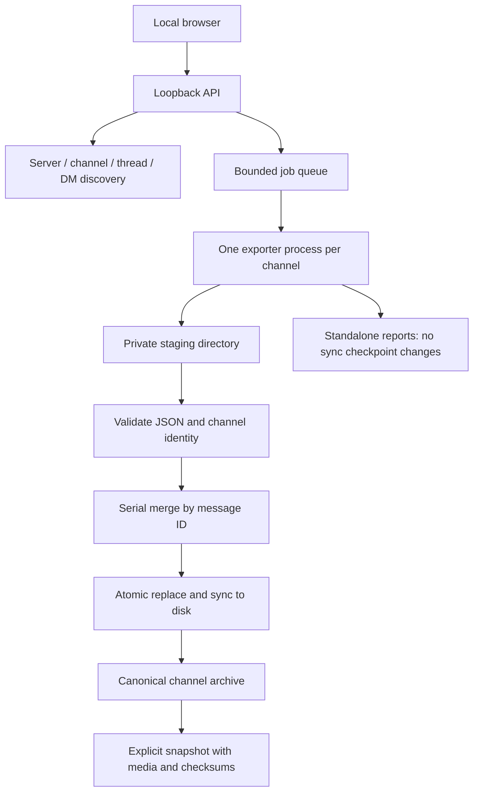

# Architecture and archive lifecycle

Discord Archive is a local orchestration layer around DiscordChatExporter. The
exporter owns Discord requests, permissions, pagination, rate limits and message
serialization. This project owns selection, jobs, persistent organization and
verified commits. It does not implement a second Discord download engine.

## Components

| Component | Responsibility |
| --- | --- |
| `dce_ui/` | English responsive UI, server/DM picker, progress, settings, exports and versions |
| `dce_dashboard.py` | Loopback HTTP API, authentication, job queue, cancellation, process supervision |
| `dce_discovery.py` | Exporter server/channel/thread/DM listings and optional server icons |
| `dce_settings.py` | Validated per-workspace preferences; atomic writes |
| `dce_exports.py` | Separate export formats, boundaries, filters, partitioning and locale |
| `dce_archive.py` | Per-channel JSON validation, media-link rebasing, deduplication and atomic commit |
| `dce_versions.py` | Immutable, explicit workspace backups with media and SHA-256 manifest |
| `dce_sync.py` | Existing CLI, archive queries, scheduling integration and upstream passthrough |
| DiscordChatExporter | Network access, serialization, media download and Discord rate-limit handling |



## On-disk layout

```text
workspace/
  channels.yaml                       # Tracked channels, IDs and display metadata
  channels.yaml.dashboard.yaml        # Download preferences, no token
  exports/
    archive/
      Server name/
        Category/
          channel-name [channel-id]/
            messages [channel-id] (pulled YYYY-MM-DD).json
    media/channel-id/                 # Reusable assets for canonical sync
    reports/Server/Category/channel [id]/run/ # Standalone HTML/CSV/text/JSON and media
    .downloads/.partial-channel-run/  # Uncommitted downloads
    .dce-sync.lock                     # Exclusive archive writer lock
  exports-versions/
    archive-UTC-timestamp-run.tar.gz   # Explicit immutable snapshots
```

Legacy root JSON files remain readable. **Organize library** first saves a recovery
version, then merges all recognized exports, including untracked historical
channels. Unreadable originals are retained under `recovery/unreadable-json/` with
a validation note. Historical channels are not automatically tracked or scheduled.
Legacy media stay in place. Existing local media links are
rebased rather than deleted. Each channel remains its own conversation; messages
from different channels are never mixed into one JSON file.

Names make folders readable, but numeric Discord channel IDs define identity.
The filename's `pulled` date is the compatibility checkpoint for the existing CLI.
A future storage schema should use stable ID directories plus an indexed manifest;
that migration would need explicit backward compatibility, not an implicit rename.

## Sync transaction and error handling

1. Acquire the workspace writer lock. Other CLI/dashboard writers fail clearly.
2. Resolve the token locally and start at most the configured number of exporter
   subprocesses (three by default). Downloading can run in parallel; merges are
   serialized to bound memory consumption.
3. Export one channel or selected thread per process to an isolated staging
   directory, with rate-limit handling enabled. Tokens travel in the subprocess
   environment, not its command-line arguments.
4. A failed retry discards that attempt's output files before retrying. A final
   failure preserves staging for inspection and never advances the archive.
5. Require successful exit and JSON output. Validate every input document,
   requested channel ID and message IDs before deleting any source.
6. Merge by message ID. Incoming copies replace earlier copies of the same
   message. Sort by timestamp and ID, recalculate message count, rebase media.
7. Write a temporary file beside its destination, flush, `fsync`, atomically
   replace the destination and sync its directory. Only then remove redundant
   source JSON files. A crash before cleanup can leave duplicates; another merge
   is idempotent and deduplicates them.
8. Report completion only after commit. Exporter percentages are estimates and
   its displayed 100% does not itself imply a valid saved archive.

Cancellation terminates the child exporter. Already committed channels stay
committed. A stopped channel never advances its checkpoint. There is no promise
of resuming halfway through a partially downloaded file; the next sync resumes
from the last committed date.

The checkpoint is the download start date, so repeated syncs overlap that day.
This captures new messages and edits in the overlap. **Refresh full history**
re-fetches accessible history and updates matching IDs, but does not remove old
messages deleted from Discord. The archive is an accumulated record, not a mirror
of Discord's current deletion state. Old reaction changes and historical edits
outside the overlap require a full refresh.

## Separate exports

**Export selected** offers JSON, dark/light HTML, CSV and plain text; after/before
boundaries; message filters; partitions; locale; reverse order. It fetches from
Discord, not from local JSON. Media, UTC, Markdown and parallelism use Settings.

Every channel and run gets a distinct reports directory. Files remain in a hidden
partial directory until successful exit and expected output exist. Reports never
participate in canonical merging, archive searches or incremental checkpoints.
A restricted export cannot accidentally claim that full history was downloaded.
HTML and CSV files are not concatenated. For JSON, use the canonical archive when
you want a single continuously merged history.

A readable report with local media is portable as its whole directory. Moving
only its HTML file leaves relative media links behind. Asset-download failures
may leave remote URLs even when the exporter reports success.

## Versioning and recovery

There are two independent kinds of versioning:

- **Application source:** Git commits, tagged releases and CI on GitHub. Tokens,
  user registries, exports and backups are excluded from the source repository.
- **Discussion data:** **Save archive version** creates a new timestamped tar.gz
  next to the output directory. It includes canonical and legacy exports, media,
  registry and saved dashboard preferences. Each file has a SHA-256 checksum in
  `manifest.json`. Temporary downloads and standalone reports are excluded.

Snapshots hold the same writer lock as sync. They are written to a temporary file
and renamed on success; cancellation does not publish a partial version. They do
not contain the separate saved token. Snapshot files have owner-only permissions.
They are full backups, not deltas; they are explicit and never automatically
pruned. Store important versions on another disk as well. Merely creating another
file on the same disk does not protect against disk failure.

To recover, stop sync, open the versions folder and extract a chosen trusted
snapshot into a **new empty folder**. Verify its files against `manifest.json`.
Use the recovered `channels.yaml` with `output_dir: exports`, and rename the
snapshot's `dashboard.yaml` to `channels.yaml.dashboard.yaml` if preferences are
wanted. Open that recovered workspace with `dce --config /path/channels.yaml app`.
Keep the current workspace until the recovered copy has been checked. Automatic
in-place restore and per-message revision browsing are not implemented.

The CLI's older `dce snapshot` command is a JSON-only backup for compatibility;
the dashboard version action additionally includes downloaded media.

## Local runtime and security boundary

The HTTP server binds to `127.0.0.1` with a random access key. The browser receives
that key in the launch URL fragment, retains it in session storage and sends it
as an API header. Discord credentials never appear in state/settings responses.
Only the configured local folders can be opened by the API. Folder-opening errors
are checked and show a manual path, rather than silently reporting success.

One process is allowed per registry. UI assets are captured when the server
starts, so updating files cannot mix a new frontend with an old backend. Restart
the local app after updates. Static assets have no external JS/font dependencies;
server icons can be loaded from Discord's CDN.

There is no browser token extraction or extension. Configuration stays manual.
The current runtime targets macOS/Linux because it uses POSIX file locks.

## Scope and deliberate boundaries

The picker supports servers, categories, active/archived threads and a Direct
messages section. Each chosen conversation can be tracked and synced separately.
"Sync server" syncs tracked channels in that server; newly created Discord channels
must first be added from the picker.

Upstream account-wide `exportall`, Discord data-package channel selection, custom
filename templates and advanced passthrough flags remain CLI functionality.
They are not claimed as dashboard controls. The safe graphical path is explicit
channel selection with isolated per-channel outcomes. Upstream compatibility and
remaining limitations are documented in [the capability review](upstream-capabilities.md).

## Storage settings and daily automation

Settings offers an absolute archive path and a native macOS folder chooser. The
new target must be empty and outside the old archive. Copying verifies every file
with SHA-256 before atomically updating `output_dir` in the registry. Configuration
comments are preserved. Cancellation or failure keeps the original location
active and cleans up files created by the failed copy. The original directory
and its sibling version backups are retained; no automatic deletion follows a
successful switch. Copying can be disabled to start a separate empty archive.

Choose Server → category → channel (default), or Server → channel. New syncs use
the chosen layout. Organize library applies it to existing files and removes empty
old archive directories. Standalone reports are grouped by server/category/channel;
old self-contained report directories and remote-only HTML are moved safely.
HTML with local dependencies is retained rather than breaking its links.

Daily schedules are explicit and disabled by default. Choose a local HH:MM time
and specific tracked channels. On macOS, Save schedule installs one per-workspace
LaunchAgent, without a token in its arguments or plist. It runs with the saved
local credential and saved download settings, even if the dashboard is closed.
When the dashboard is open, the scheduled worker delegates to it so progress is
visible. An already busy workspace is skipped; it does not start a competing sync.
Preferences live in `channels.yaml.schedule.yaml`, last-run results in
`channels.yaml.schedule-state`, and diagnostics in `channels.yaml.schedule.log`.
A disconnected workspace is skipped without creating a replacement directory.

The schedule follows local system time, requires a logged-in user and a powered-on
Mac, and a scheduled invocation missed during sleep runs after waking. Power-off
is not sleep; no catch-up guarantee is made for a powered-off machine. These are
[Apple's LaunchAgent scheduling semantics](https://developer.apple.com/library/archive/documentation/MacOSX/Conceptual/BPSystemStartup/Chapters/ScheduledJobs.html).
Disabling a schedule unloads and removes only this workspace's agent. Saving new
settings rolls back the previous schedule if registration fails. Linux's built-in
scheduler integration is not implemented; use the CLI with cron/systemd there.

Recovery versions also include schedule preferences as `schedule.yaml`. Restoring
these preferences does not install a LaunchAgent automatically: explicitly save
and enable the schedule in the restored workspace.
